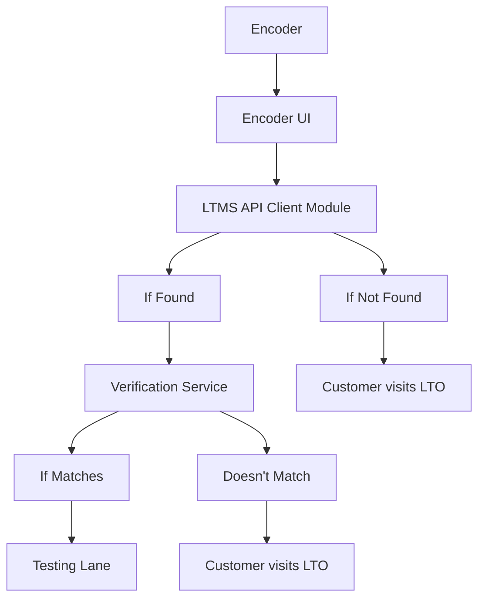

# Encoder Application

The Encoder Application retrieves the vehicle details from LTMS using either
Plate Number or MV File Number from customer's Official Receipt and/or
Certification of Registration.

## Features

- Authentication Module
- Encoder UI
- LTMS Integration
- Record Validation Module
- Testing Lane Dispatch
- Audit Logging Module
- Admin Panel

## Architecture

_For detailed architecture, see [Architecture Overview](docs/architecture.md)_

## Tech Stack

- **Front-End:** React + Typescript
- **Back-End:** Spring Boot
- **Database:** PostgreSQL
- **Testing:** JUnit5, Mockito, TestContainers
- **External Integrations:** LTMS API
- **API Client:** Web Client (Spring's Reactive API)
- **Message Queue:** To Be Decided (TBD)
- **Configuration:** DotEnv, YAML Config
- **Observability:** Spring Actuator or LogBack, TBD

## Usage

None for now...

## Documentation

- [Architecture Overview](docs/architecture.md)
- [Business Workflow](docs/workflow.md)
- [ERD and Data Models](docs/erd.md)
- [[Database Roles]]
- [Development Plan](docs/dev-plan.md)
